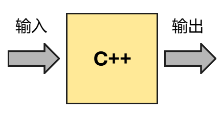

# 循环语句

## 总结复习

---

目前为止，我们学习的c++语法知识，总共有三条逻辑主线：

* 输入输出
* 数据计算
* 流程控制

### 输入输出

---

一个算式，例如 $3x+1$ ，当 $x$ 具有不同的值，那么算式也会具有不同的值。当 $x=1$时，算式的值是4。  
那么 $1$ 就是算式的输入， $4$ 就是算式的输出。

木匠使用送来的木材，加工后变成木椅、木凳等产品。木材是木匠的输入，木椅、木凳是木匠的输出。

果汁店卖苹果汁、西瓜汁、梨汁。顾客可能会下任意一种可能的订单。那么顾客的订单是果汁店的输入，苹果汁 | 西瓜汁 | 梨汁是果汁店的输出。

输入语句：cin
输出语句：cout

记忆方法：

* in：进去
* out：出去

输入是把数据送到盒子里面，箭头要朝向盒子，所以是>>

```cpp
int a;
cin>>a;
```

输出是把盒子里面的数据送出去，箭头要朝外，所以是<<

```cpp
int a = 1;
cout<<a;
```



### 数据计算

---

**常量与变量**

变量是盒子，常量是盒子里面装的东西。

想要往盒子里面装东西，首先我们要把盒子创建出来。

```cpp
a = 1;
int a;
```

以上代码编译失败。

想要创建盒子，我们要做的是：

* 指定盒子里面装什么样的东西（也就是盒子的类型）
* 给盒子取名字

我们学习了三种类型的盒子：

* int用来装整数
* double用来装小数（也叫实数、浮点数）
* char用来装字符（例如加号、乘号）

盒子的合法名字包括：英文字母、非开头的数字、下划线，且不为关键词例如："if"、"int"等。

以下名字是合法的：

```cpp
int a,b,c;
int hi123;
int cake_cnt;
int ___temp;
```

以下名字是非法的：

```cpp
int int;
int 123;
int 3class;
```

要往盒子里面装东西，我们学了哪几种方法？

* 赋值（一个等号）
* cin语句

```cpp
int a=1;
int b;
cin>>b;
```

在我们给盒子装东西之前，我们知道这个盒子里面装的是什么东西吗？

```cpp
int a;
cout<<a;
```

换不同的编译器运行这段代码，结果不一样。

**数学表达式**

c++可以对变量和常量进行数学计算。

```cpp
int a,b,c;
a = 2;
b = 3;
c = 4*a*b;
cout<<c;
```

c的输出结果是24

```cpp
int a;
a = 1;
a = a+1;
a = a+1;
cout<<a;
```

a的输出结果3

我们学习了以下五种数学计算：

* 加法：+
* 减法：-
* 乘法：*
* 整除：/
* 取模：%

其中乘除模运算优先级比加减运算优先级要高。还可以加括号改变运算优先级。

```cpp
int a=1, b=2, c=3;
cout<<a+b*c<<endl;
cout<<(a+b)*c<<endl
```

输出结果分别是7和9

**逻辑表达式**

在逻辑表达式中，1表示真，0表示假。

两个数值之间大小关系的判断：

```cpp
int a=1,b=2;
// 判断相等（两个等号）
cout<<(a==b)<<endl;
// 判断不等
cout<<(a!=b)<<endl;
// 判断大于
cout<<(a>b)<<endl;
// 判断大于等于
cout<<(a>=b)<<endl;
// 判断小于
cout<<(a<b)<<endl;
// 判断小于等于
cout<<(a<=b)<<endl;
```

输出值分别是0,1,0,0,1,1

逻辑表达式的复合运算：

&&表示两个条件必须同时成立  
||表示两个条件有一个成立即可
!表示原条件不成立，则该条件成立

例如1<=a<=5这个范围，其实是两个条件，在c++语言中应表达为两个条件的&&

```cpp
int a;
cin>>a;
if(a>=1&&a<=5) cout<<"yes";
else cout<<"no";
```

### 流程控制

**顺序结构**

**分支结构**

**循环结构**

## 问题情景

小猪佩奇吃蛋糕。小猪佩奇今天可能想吃蛋糕，但是也可能不想吃。

```cpp
#include <bits/stdc++.h>

using namespace std;

int main()
{
	cout<<"piggy: i want a cake?"<<endl;
	int cake;
	cin>>cake;
	if(cake==1) cout<<"piggy take a cake."<<endl;
	return 0;
}
```

小猪佩奇今天还可能想吃2个蛋糕。

```cpp
#include <bits/stdc++.h>

using namespace std;

int main()
{
	cout<<"piggy: i want a cake?"<<endl;
	int cake;
	cin>>cake;
	if(cake>=1) cout<<"piggy take a cake."<<endl;
	if(cake>=2) cout<<"piggy take a cake."<<endl;
	return 0;
}
```

小猪佩奇今天还可能想吃3个蛋糕。

```cpp
#include <bits/stdc++.h>

using namespace std;

int main()
{
	cout<<"piggy: i want a cake?"<<endl;
	int cake;
	cin>>cake;
	if(cake>=1) cout<<"piggy take a cake."<<endl;
	if(cake>=2) cout<<"piggy take a cake."<<endl;
    if(cake>=3) cout<<"piggy take a cake."<<endl;
	return 0;
}
```

如果小猪佩奇今天想吃100个蛋糕怎么办呢？

```cpp
#include <bits/stdc++.h>

using namespace std;

int main()
{
	cout<<"piggy: i want a cake?"<<endl;
	int cake;
	cin>>cake;
	while(cake>=1) cout<<"piggy take a cake."<<endl;
	return 0;
}
```

小猪佩奇被无穷多个蛋糕撑死了。我们不能给她塞无穷多个蛋糕，我们需要控制蛋糕次数。

## 循环概念

while循环由两部分组成：

* 判断条件
* 循环体

遇到while语句时，先判断条件是否成立，如果成立才进入循环体执行代码。

循环体的代码执行结束后，再判断条件是否依然成立，如果依然成立就继续进入循环体执行代码。

重复上述过程直到判断条件不再成立。

如果判断条件一直都成立，循环永远也不会结束，这样的循环我们称之为死循环。

```cpp
while(1)
{
    cout<<"hi"<<endl;
}
```

## 解决问题

为了不让小猪佩奇撑死，我们得控制循环条件，不能陷入死循环。

那么我们该怎么修改原来的代码，使得循环条件能够不成立呢？

```cpp
#include <bits/stdc++.h>

using namespace std;

int main()
{
	cout<<"piggy: i want a cake?"<<endl;
	int cake;
	cin>>cake;
	while(cake>=1)
	{
		cout<<"piggy take a cake."<<endl;
		cake = cake-1;
	}
	return 0;
}
```

假如小猪佩奇想要3块蛋糕。当我们给了她一块蛋糕后，小猪佩奇现在还想要2块蛋糕。把cake变量减1即可。

2块蛋糕>=1仍然成立，所以我们又给了她一块蛋糕，小猪佩奇现在还想要1块蛋糕。

1块蛋糕>=1仍然成立，所以我们又给了她一块蛋糕，小猪佩奇现在还想要0块蛋糕。

循环结束，我们总共给了她3块蛋糕。

我们还可以在循环体中顺便记录，佩奇还想要几块蛋糕。

```cpp
#include <bits/stdc++.h>

using namespace std;

int main()
{
	cout<<"piggy: i want a cake?"<<endl;
	int cake;
	cin>>cake;
	while(cake>=1)
	{
		cout<<"still want: "<<cake<<" cake."<<endl;
		//cout<<"piggy take a cake."<<endl;
		cake = cake-1;
	}
	return 0;
}
```

代码前面加两个斜杠：//的意思是注释，使得这行代码不执行。

我们实现了从100倒数到1。

那么如何实现从1数到100呢？

```cpp
int i = 1;
while(?)
{
    cout<<i<<endl;
    i = i+1;
}
```

数到100才停止，这里面包括100，所以101使得条件不成立，100及以前的数字使得条件成立，这里的条件应该填写i<=100

```cpp
int i = 1;
while(i<=100)
{
    cout<<i<<endl;
    i = i+1;
}
```

数100以内的全部正奇数又该怎样做呢？此时我们应从1开始，每次步长+2

```cpp
int i = 1;
while(i<=100)
{
    cout<<i<<endl;
    i = i+2;
}
```

数100以内的全部正偶数又该怎样做呢？此时我们应从2开始，每次步长+2

```cpp
int i = 2;
while(i<=100)
{
    cout<<i<<endl;
    i = i+2;
}
```