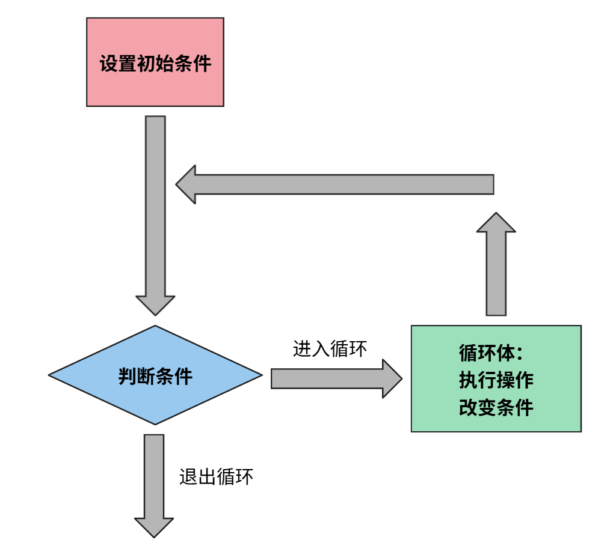
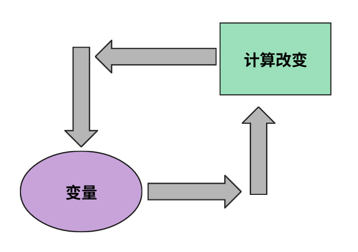

# for循环

## 课前复习

循环的基本结构

```cpp
//设置初始条件
while(//判断条件)
{
    //循环体
    //执行操作，改变条件
}
```



什么是迭代？

```cpp
int a = 1;
a = a+1;
a = a+1;
a = a+1;
cout<<a;
```



使用变量原有的值，重新改变变量的值。

再例如求和的迭代

```cpp
int a=1,b=2,c=3;
int sum=0;
sum = sum+a;
sum = sum+b;
sum = sum+c;
cout<<sum;
```

小猪佩奇想吃100个蛋糕，这个while循环如何编写？

```cpp
int cake = 100;
while(cake>=1)
{
    cout<<"piggy take a cake."<<endl;
    cake = cake-1;
}
```

cout语句被执行了几次？cake>=1这个条件被判断了几次？

从1数到100，这个while循环如何编写？

```cpp
int i=1;
while(i<=100)
{
    cout<<i<<endl;
    i = i+1;
}
```

cout语句被执行了几次？i<=100这个条件被判断了几次？

习题：P1806、P1807

## 语法介绍

### break和continue语句

回到小猪佩奇吃蛋糕

```cpp
int cake = 100;
while(cake>=1)
{
    cout<<"piggy take a cake."<<endl;
    cake = cake-1;
}
```

假如小猪佩奇今天最多只能吃5块蛋糕，如何记录小猪佩奇已经吃了多少个蛋糕？

```cpp
int cake = 100, cake_take = 0;
while(cake>=1)
{
    if(cake_take>=5) break;
    cout<<"piggy take a cake."<<endl;
    cake_take = cake_take + 1;
    cake = cake-1;
}
```

假如我们想把第3块蛋糕偷偷换成酸的蛋糕 (sour cake)

```cpp
int cake = 100, cake_take = 0;
while(cake>=1)
{
    if(cake_take==3)
    {
        cout<<"piggy take a sour cake."<<endl;
        cake_take = cake_take + 1;
        cake = cake-1;
        continue;
    }
    if(cake_take>=5) break;
    cout<<"piggy take a cake."<<endl;
    cake_take = cake_take + 1;
    cake = cake-1;
}
```

### 迭代的简写

```cpp
// program_1
int a=1,b=2;
a = a+b;
a = a+b;
a = a+b;

// program_2
int a=1,b=2;
a += b;
a += b;
a += b;
```

以上两段代码是等价的

```cpp
// program_1
int a=1;
a += 1;
a += 1;
a += 1;

// program_2
int a=1;
a++;
a++;
a++;
```

以上两段代码是等价的

类似地，还有-=和--

```cpp
int i = 100;
while(i>=1)
{
    cout<<i<<endl;
    i--;
}
```

### for循环的简写

```cpp
for(int i=100;i>=1;i--) cout<<i<<endl;
```

原本6行的代码现在只需要一行，而且循环的起始设置、条件判断、条件迭代写在一起，更加清晰

重新练习：P1806、P1807

## 应用问题

### 求和问题

### 变式求和

### 作业讲解