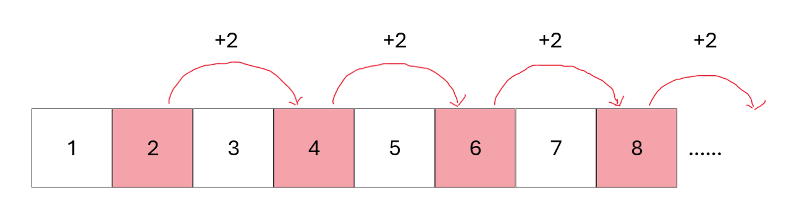
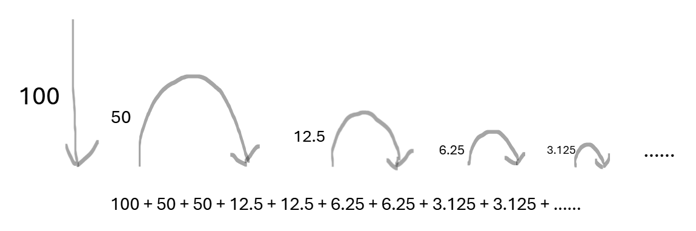
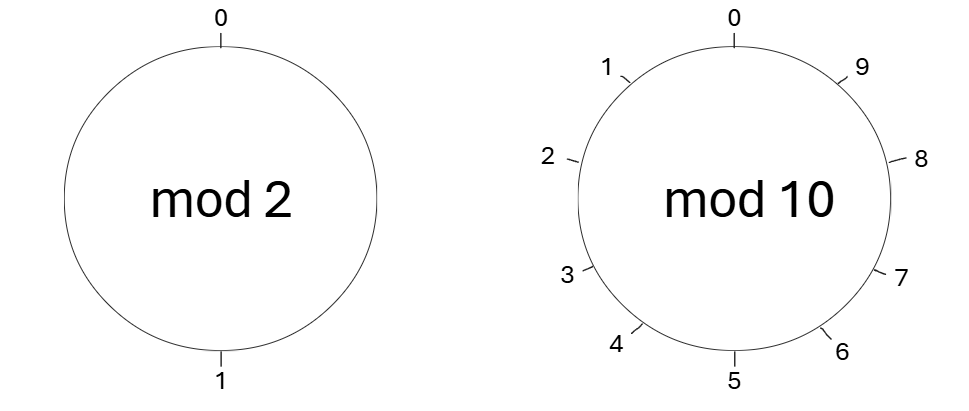

# 循环练习

## 课前复习

什么是迭代？解释以下代码的含义

```cpp
int a=1,b=2,c=1;
c++;
c++;
cout<<c<<endl;
int sum=0;
sum+=a;
sum+=b;
sum+=c;
cout<<sum<<endl;
```

循环的基本结构是什么？回忆一下for循环三个部分，以及执行的流程

```cpp
int n;
cin>>n;
int sum=0;
for(int i=1;i<=n;i++) sum+=i;
cout<<sum<<endl;
```

## 作业讲解

### P5307



$2$ 对应循环基本结构中的初始条件。$+2$ 对应循环基本结构中的迭代操作。

遍历到 $100$，循环终止，所以循环条件是：$i<=100$

如果要遍历100以内所有的奇数呢？

第一个数字前面没有顿号，后面每个数字前面都有顿号。用变量first记录是不是第一个输出。

```cpp
#include <bits/stdc++.h>

using namespace std;

int main()
{
    int first = 1;
    for(int i=2;i<=100;i+=2)
    {
        if(first==0) cout<<"、";
        cout<<i;
        first = 0;
    }
    cout<<".";
    return 0;
}
```

### P5064



```cpp
#include <bits/stdc++.h>

using namespace std;

int main()
{
    double s = 100.0;
    for(double h = 50.0;h>=0.5;h/=2)
    {
        s+=h;
        s+=h;
    }
    cout<<"小球弹跳的总路程是:"<<fixed<<setprecision(3)<<s;
    return 0;
}
```

### P5080

P1014写过这样的代码

```cpp
#include<bits/stdc++.h>

using namespace std;

int main()
{
    double sum=0.0;
    int n;
    cin>>n;
    for(int i=1;i<=n;i++) sum+=1.0/i;
    cout<<fixed<<setprecision(3)<<sum;
    return 0;
}
```

之前是输入n，要求sum，现在是输入x，要求n。

```cpp
#include <bits/stdc++.h>

using namespace std;

int main()
{
    int x;
    cin>>x;
    double sum = 0.0;
    int i;
    for(i=1;sum<=x;i++) sum+=1.0/i;
    cout<<i-1<<endl;
    return 0;
}
```

## 课堂练习

### P5093

第一种方法：运行两次循环，分别计算。

```cpp
#include <bits/stdc++.h>

using namespace std;

int main()
{
    int n;
    cin>>n;
    int sum = 0;
    for(int i=1;i<=n;i+=2) sum+=i;
    cout<<sum<<" ";
    sum = 0;
    for(int i=2;i<=n;i+=2) sum+=i;
    cout<<sum;
    return 0;
}
```

第二种方法：在一次循环里面套if分支。

```cpp
#include <bits/stdc++.h>

using namespace std;

int main()
{
    int n;
    cin>>n;
    int sum_odd = 0, sum_even = 0;
    for(int i=1;i<=n;i++)
    {
        if(i%2==0) sum_even += i;
        else sum_odd += i;
    }
    cout<<sum_odd<<" "<<sum_even;
    return 0;
}
```

### P1027



沿着mod 10钟表前进n格，钟表上的刻度就是n的个位数

```cpp
int a = 123;
int b = a%10; //把a的个位数取出来
a /= 10; //把a的个位数截掉
```

拆分个十百位，并求和的代码。

```cpp
#include <bits/stdc++.h>

using namespace std;

int main()
{
    int x;
    cin>>x;
    int sum = 0;
    sum += x%10; //加上个位数
    x /= 10; //原来的十位数变成了现在的个位数
    sum += x%10; //加上十位数
    x /= 10;  //原来的百位数变成了现在的个位数
    sum += x; //加上百位数
    cout<<sum;
    return 0;
}
```

### P5199

拆分所有位的代码

```cpp
#include <bits/stdc++.h>

using namespace std;

int main()
{
	int n;
	cin>>n;
	while(n)
	{
		cout<<n%10<<", ";
		n /= 10;
	}
	return 0;
}
```

只需要把这些位再不断乘10加起来

```cpp
#include <bits/stdc++.h>

using namespace std;

int main()
{
	int n;
	cin>>n;
	int ans = 0;
	while(n)
	{
		ans = ans*10+n%10;
		n /= 10;
	}
	cout<<ans;
	return 0;
}
```

最后再处理负数

```cpp
#include <bits/stdc++.h>

using namespace std;

int main()
{
	int n;
	cin>>n;
	char sign = '';
	if(n<0)
	{
		sign = '-';
		n *= -1;
	}
	int ans = 0;
	while(n)
	{
		ans = ans*10+n%10;
		n /= 10;
	}
	cout<<sign<<ans;
	return 0;
}
```